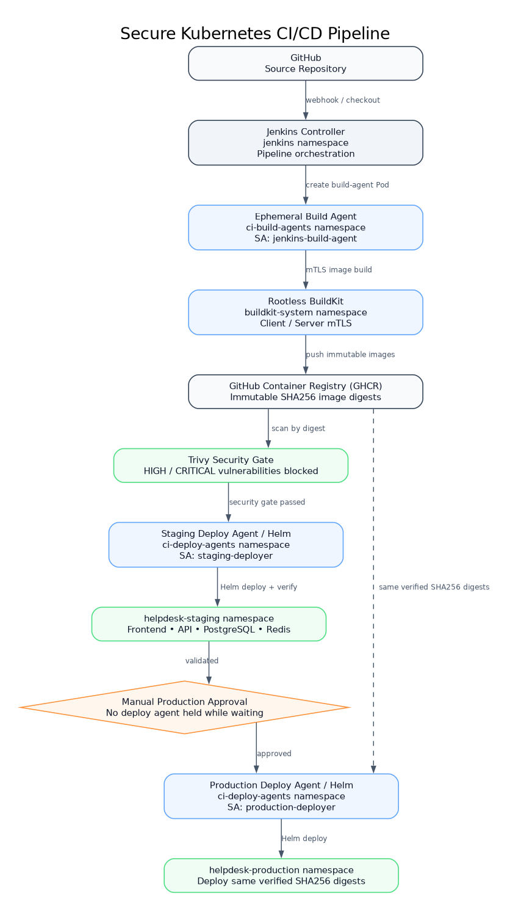

# Secure Kubernetes CI/CD Platform

**Jenkins · Kubernetes · Rootless BuildKit · mTLS · GHCR · Trivy · Helm · Envoy Gateway · Prometheus**

A Kubernetes and Platform Engineering project demonstrating secure CI/CD, ephemeral Jenkins agents, rootless image builds over mTLS, immutable SHA256 artifact promotion, staged Helm delivery, least-privilege Kubernetes security, resilience testing, and metrics-based observability.

> **Scope:** Implemented and validated on a multi-node Kind cluster. AWS/EKS is documented as a production architecture mapping, not claimed as deployed infrastructure.



---

## Architecture

```text
GitHub
   ↓
Jenkins Controller
   ↓
Ephemeral Kubernetes Agents
   ↓
mTLS
   ↓
Rootless BuildKit
   ↓
GHCR Immutable Image Digests
   ↓
Trivy Security Gate
   ↓
Helm
   ↓
Staging
   ↓
Validation
   ↓
Manual Approval
   ↓
Same Immutable Artifact
   ↓
Production
```

---

## Architecture Diagrams

- [01 — CI/CD Pipeline Flow](docs/diagrams/01-ci-cd-pipeline-flow.png)
- [02 — Jenkins Controller & Ephemeral Agents](docs/diagrams/02-jenkins-ephemeral-agents.png)
- [03 — Observability Architecture](docs/diagrams/03-observability-architecture.png)
- [04 — AWS/EKS Production Mapping](docs/diagrams/04-aws-eks-production-mapping.png)

---

## Core Technologies

- Kubernetes
- Jenkins
- Ephemeral Kubernetes Agents
- Rootless BuildKit
- mTLS
- GitHub Container Registry (GHCR)
- Helm
- Gateway API
- Envoy Gateway
- RBAC
- ServiceAccounts
- Pod Security
- NetworkPolicies
- Persistent Volumes
- StatefulSets
- Horizontal Pod Autoscaler (HPA)
- PodDisruptionBudget (PDB)
- Prometheus
- Grafana
- Alertmanager
- kube-state-metrics
- Node Exporter
- Docker / OCI Images
- Git / GitHub
- Kind Multi-Node Kubernetes Cluster

---

## CI/CD Architecture

Jenkins runs inside Kubernetes as the CI/CD controller.

Pipeline workloads use temporary Kubernetes agent Pods instead of permanent build workers.

```text
Jenkins Controller
       ↓
Dynamic Kubernetes Agent
       ↓
Rootless BuildKit
       ↓
GHCR
       ↓
Helm
       ↓
Staging
       ↓
Production
```

### Key CI/CD Features

- Jenkins controller deployed on Kubernetes
- Dynamic ephemeral Kubernetes build agents
- One-executor-per-agent strategy
- Rootless container builds
- BuildKit communication protected with mTLS
- Images stored in GHCR
- Immutable SHA256 image digests
- Helm-based deployments
- Staging and Production environments
- Same tested artifact promoted to Production

---

## Rootless BuildKit + mTLS

Application container images are built using rootless BuildKit.

BuildKit communication is protected using mutual TLS.

This provides:

- encrypted communication
- client authentication
- server authentication
- reduced build privileges
- isolation from the Jenkins controller

---

## Immutable Image Promotion

Deployments use immutable image digests instead of mutable tags.

### API

```text
ghcr.io/awais-clouddev/kubernetes-jenkins-platform-api@sha256:96eff54d5611f3b5d3a08fe9c0a3bc8b5fce1e99f2f9cd0331baf8c2a053adc2
```

### Frontend

```text
ghcr.io/awais-clouddev/kubernetes-jenkins-platform-frontend@sha256:005b4543ec059e9f2fb995218c9a2ceb0825865299eca9a004190aa6059bf49a
```

The same API and frontend digests were verified in both Staging and Production.

```text
Staging Artifact
      ↓
Validation
      ↓
Promotion
      ↓
Production

No rebuild between environments
```

This prevents artifact drift between Staging and Production.

---

## Helm Deployment

Helm manages the Kubernetes application deployment.

The chart contains:

- API Deployment
- Frontend Deployment
- Redis Deployment
- PostgreSQL StatefulSet
- Services
- ConfigMaps
- Secrets
- HPA
- PDB
- environment-specific values

Environment-specific configuration is separated using:

```text
values-staging.yaml
values-production.yaml
```

---

## Staging Environment

The Staging environment contains:

- 2 API replicas
- 2 Frontend replicas
- Redis
- PostgreSQL
- Persistent storage
- Horizontal Pod Autoscaler
- PodDisruptionBudget
- NetworkPolicies
- Gateway API routes

---

## Production Environment

The Production environment contains:

- 3 API replicas
- 3 Frontend replicas
- Redis
- PostgreSQL
- Persistent storage
- PodDisruptionBudget
- NetworkPolicies
- immutable API artifact
- immutable Frontend artifact

The Production deployment uses the same application image digests verified in Staging.

---

## Kubernetes Security

The platform implements multiple Kubernetes security controls.

### RBAC

Namespace-scoped RBAC limits Kubernetes API permissions.

### ServiceAccounts

Dedicated ServiceAccounts provide workload identities.

### Pod Security

Restricted Pod Security controls prevent unsafe container configurations such as:

- privilege escalation
- unrestricted Linux capabilities
- unsafe security contexts

### NetworkPolicies

Default-deny policies establish a zero-trust network baseline.

Explicit communication rules allow only required traffic.

Examples:

```text
API → PostgreSQL : 5432
API → Redis      : 6379
Pods → DNS       : 53
Envoy → Frontend
Envoy → API
Prometheus → monitored workloads
```

---

## Gateway API

Application ingress is implemented using Kubernetes Gateway API and Envoy Gateway.

Architecture:

```text
Client
  ↓
Gateway API
  ↓
Envoy Gateway
  ↓
HTTPRoute
  ↓
Kubernetes Service
  ↓
Application Pods
```

Staging and Production HTTPRoutes expose the Helpdesk application through:

```text
staging.helpdesk.local
production.helpdesk.local
```

API traffic uses an `/api` prefix externally, which Gateway API rewrites before requests reach the FastAPI backend.

---

## Persistent Storage

PostgreSQL runs as a StatefulSet.

Storage uses:

- PersistentVolumeClaim
- Kubernetes StorageClass
- persistent volume lifecycle independent of Pod lifecycle

This allows PostgreSQL data to survive Pod recreation.

The local environment uses Kind/local-path storage.

---

## Horizontal Pod Autoscaler

The Staging API demonstrates Horizontal Pod Autoscaling with a minimum of 2 and maximum of 5 replicas.

Production uses fixed replica counts in the final local-lab configuration.

Architecture:

```text
Metrics
  ↓
HPA Controller
  ↓
Staging API Deployment
  ↓
More / Fewer Pods
```

---

## PodDisruptionBudget

The API workload uses a PodDisruptionBudget.

The PDB maintains minimum application availability during voluntary disruptions such as node maintenance.

This was validated during a Kubernetes worker drain.

Observed behavior:

```text
Worker Drain
    ↓
Pod Eviction
    ↓
PDB Protection
    ↓
Pod Rescheduling
    ↓
Application Recovery
```

---

## Observability

The platform uses `kube-prometheus-stack`.

Components include:

- Prometheus
- Grafana
- Alertmanager
- kube-state-metrics
- Node Exporter
- Prometheus Operator

Prometheus collects infrastructure and Kubernetes metrics.

Grafana provides visualization.

Alertmanager handles Prometheus alerts.

---

## Real Alert Validation

A custom application availability alert was implemented.

Alert lifecycle tested:

```text
Healthy
   ↓
Condition triggered
   ↓
Pending
   ↓
Firing
   ↓
Alertmanager received alert
   ↓
Condition removed
   ↓
Resolved
```

This proves the complete Prometheus → Alert Rule → Alertmanager flow.

---

## Helm Failure and Rollback

Rollback behavior was validated during failed deployment scenarios, including the Build 17 DNS/readiness failure path.

Helm detected that the new release could not become healthy and restored the previous known-good release.

Verified sequence:

```text
Working Release
      ↓
New Deployment
      ↓
Health / Readiness Failure
      ↓
Failed Helm Release
      ↓
Rollback
      ↓
Previous Known-Good Release Restored
```

This demonstrated that the deployment workflow could recover safely from an unhealthy release rather than only handling successful deployments.

---

## Worker Drain Resilience

A Kubernetes worker node was drained to test workload resilience.

During the test:

- the node was cordoned
- Pods were evicted
- PDB behavior was observed
- replacement Pods were scheduled
- application availability recovered
- the worker was uncordoned

Both Staging and Production workloads recovered successfully.

---

## Final Platform Validation

Final validation confirmed:

- all Kubernetes nodes Ready
- Staging API healthy
- Staging Frontend healthy
- Staging Redis healthy
- Staging PostgreSQL healthy
- Production API healthy
- Production Frontend healthy
- Production Redis healthy
- Production PostgreSQL healthy
- Gateway programmed
- HTTPRoutes configured
- Prometheus running
- Grafana running
- Alertmanager running
- Helm rollback completed
- immutable artifact promotion verified

Final evidence is stored in:

```text
evidence/final-platform-proof.txt
evidence/final-security-audit.txt
```

---

## Repository Structure

```text
kubernetes-jenkins-platform/
│
├── docs/
│
├── evidence/
│
├── helm/
│   └── helpdesk/
│       ├── templates/
│       ├── values.yaml
│       ├── values-staging.yaml
│       └── values-production.yaml
│
├── jenkins/
│
├── k8s/
│   ├── gateway-api/
│   └── network-policies/
│
├── observability/
│   ├── alerts/
│   └── kube-prometheus-stack-values.yaml
│
└── README.md
```

---

## Evidence

The repository contains evidence from implementation and validation.

Examples include:

```text
evidence/
├── final-platform-proof.txt
├── final-security-audit.txt
├── phase10-pipeline/
├── phase19-network-policy-tests.txt
├── phase20-pod-security-denial.txt
└── phase21-hpa-autoscaling.txt
```

---

## AWS / EKS Architecture Mapping

This project runs locally on a multi-node Kind Kubernetes cluster and includes a documented AWS/EKS architecture mapping for cloud deployment.

### Local → AWS Production Mapping

| Local Project | AWS Production Equivalent |
|---|---|
| Kind Kubernetes | Amazon EKS |
| GHCR | Amazon ECR or GHCR |
| Local-path storage | Amazon EBS / EFS |
| PostgreSQL StatefulSet | Amazon RDS |
| Envoy Gateway | AWS ALB / NLB integration |
| ServiceAccounts | IAM / EKS Pod Identity |
| Kubernetes RBAC | EKS RBAC + IAM |
| Prometheus / Grafana | Amazon Managed Prometheus / Grafana or self-managed |
| Local worker nodes | EC2 / managed node groups |
| Kubernetes networking | VPC / Security Groups / Network Policies |

---

## Key Engineering Concepts Demonstrated

This project demonstrates:

- Kubernetes platform architecture
- dynamic CI/CD workers
- secure image building
- mTLS
- immutable artifacts
- environment promotion
- Helm release management
- rollback
- RBAC
- workload identity
- Pod Security
- zero-trust NetworkPolicies
- application routing
- persistent storage
- autoscaling
- disruption protection
- monitoring
- alerting
- resilience testing
- platform troubleshooting

---

## Local Lab Scope & Limitations

The implementation was built and validated on a multi-node Kind cluster running locally under WSL. It is not presented as a public production deployment.

- **AWS/EKS:** documented as an architecture mapping only; no live EKS environment was deployed.
- **Observability:** metrics, dashboards, and alerting were implemented with Prometheus, Grafana, and Alertmanager; centralized logging is outside the current scope.
- **Autoscaling:** HPA was validated in Staging; Production uses fixed replica counts in the final local-lab configuration.
- **Local networking:** some connectivity rules and Kubernetes API addressing are specific to the Kind/WSL environment.
- **Artifact promotion:** the same immutable SHA256 image digests are promoted from Staging to Production within the pipeline; fully reproducible independent rebuilds are not claimed.

These boundaries distinguish behavior validated in the lab from cloud deployment assumptions.

---

## Project Goal

The goal of this project is to demonstrate how:

```text
CI/CD
Kubernetes
Security
Networking
Storage
Scaling
Observability
Resilience
Artifact Promotion
```

work together as one integrated Platform Engineering system rather than as isolated technologies.

---

## Project Status

**Core Kubernetes / Platform Engineering implementation complete.**

Completed areas include:

- Jenkins Kubernetes integration
- ephemeral Kubernetes agents
- rootless BuildKit
- mTLS
- GHCR immutable artifacts
- Helm deployments
- Staging environment
- Production environment
- immutable artifact promotion
- RBAC
- ServiceAccounts
- Pod Security
- NetworkPolicies
- Gateway API
- persistent storage
- HPA
- PDB
- Prometheus
- Grafana
- Alertmanager
- real alert validation
- Helm rollback
- worker-drain resilience
- final platform evidence

