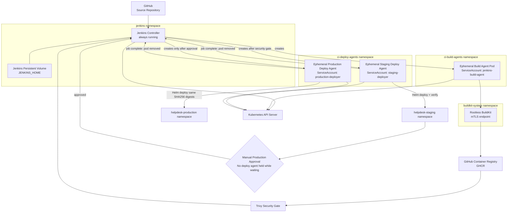

# Jenkins Controller and Ephemeral Agent Architecture

This diagram documents how the Jenkins controller orchestrates short-lived Kubernetes agents for build, staging deployment, and production deployment.



## Agent lifecycle

```text
Jenkins Controller
      |
      +--> create Build Agent
      |       |
      |       +--> checkout / test / BuildKit / GHCR / Trivy
      |       |
      |       +--> delete Build Agent
      |
      +--> create Staging Deploy Agent
      |       |
      |       +--> Helm deploy + verify staging
      |       |
      |       +--> delete Staging Deploy Agent
      |
      +--> Manual Approval
      |       |
      |       +--> no deploy agent held while waiting
      |
      +--> create Production Deploy Agent
              |
              +--> Helm deploy same immutable digests
              |
              +--> delete Production Deploy Agent
```

## Security boundaries

- Jenkins controller runs separately from build and deployment agents.
- Build agent uses its dedicated `jenkins-build-agent` ServiceAccount.
- Staging uses the dedicated `staging-deployer` ServiceAccount.
- Production uses the dedicated `production-deployer` ServiceAccount.
- BuildKit is isolated in `buildkit-system` and requires client/server mTLS.
- Deploy agents are ephemeral and protected by NetworkPolicies.
- Staging and production RBAC are separated.
- Production deploy agent is created only after manual approval.
