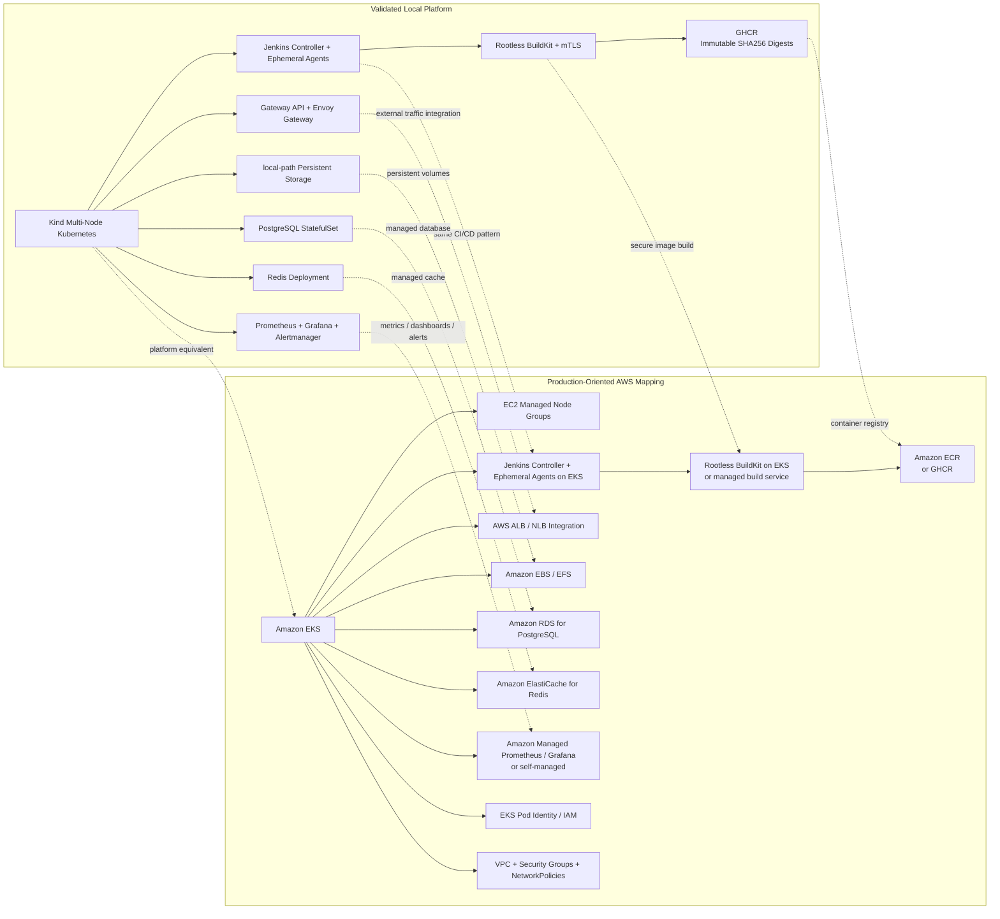

# AWS / EKS Production Mapping

This diagram maps the validated local Kind platform to a production-oriented AWS architecture.

> **Scope:** AWS resources are architectural equivalents only. This project was validated locally on a multi-node Kind cluster; Amazon EKS, RDS, ElastiCache, EBS/EFS, and managed AWS observability services were not deployed by this project.

## Local to AWS mapping

| Local implementation | Production-oriented AWS equivalent |
|---|---|
| Kind multi-node Kubernetes | Amazon EKS |
| Local worker nodes | EC2 managed node groups |
| Jenkins controller + ephemeral Kubernetes agents | Jenkins controller + ephemeral agents on EKS |
| Rootless BuildKit + mTLS | Rootless BuildKit on EKS or a managed build service |
| GHCR | Amazon ECR or GHCR |
| Gateway API + Envoy Gateway | AWS ALB / NLB integration |
| local-path storage | Amazon EBS / EFS |
| PostgreSQL StatefulSet | Amazon RDS for PostgreSQL |
| Redis Deployment | Amazon ElastiCache for Redis |
| Kubernetes ServiceAccounts | EKS Pod Identity / IAM |
| Kubernetes RBAC | Kubernetes RBAC + AWS IAM / EKS access controls |
| NetworkPolicies | VPC + Security Groups + Kubernetes NetworkPolicies |
| Prometheus / Grafana / Alertmanager | Amazon Managed Prometheus / Grafana or self-managed |

## Production design principles

- Preserve immutable SHA256 artifact promotion between environments.
- Keep build and deployment workers ephemeral.
- Replace local storage and stateful database/cache workloads with managed AWS services where appropriate.
- Use AWS identity integration instead of static cloud credentials.
- Keep namespace-scoped RBAC and NetworkPolicy controls inside EKS.
- Use private networking and production-specific Kubernetes API access rules.
- Treat this diagram as a production mapping, not evidence that AWS resources were deployed.
